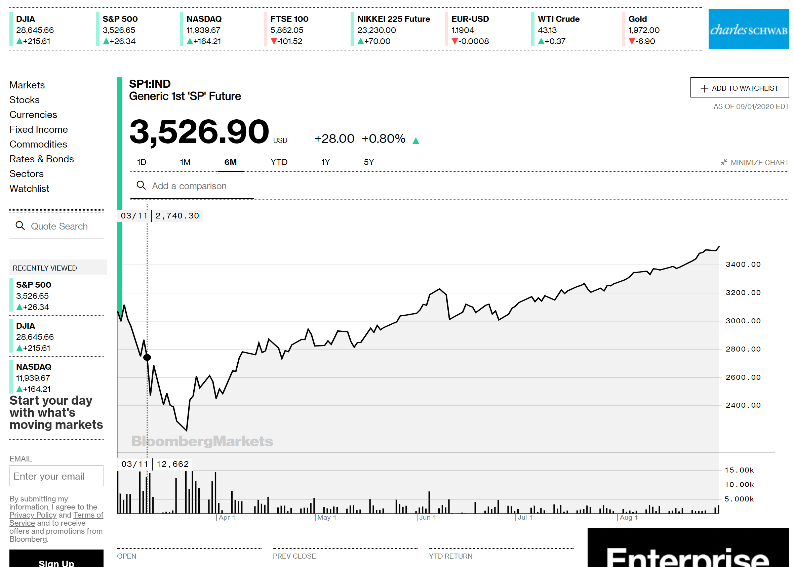
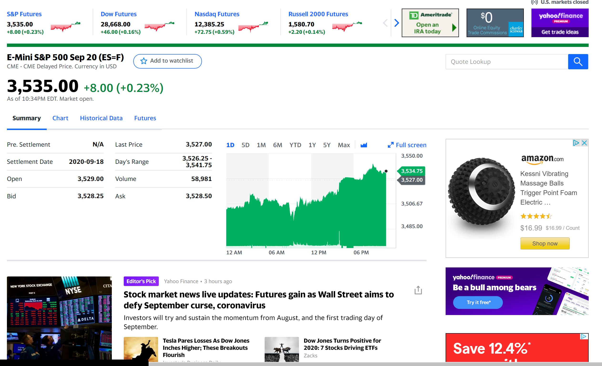
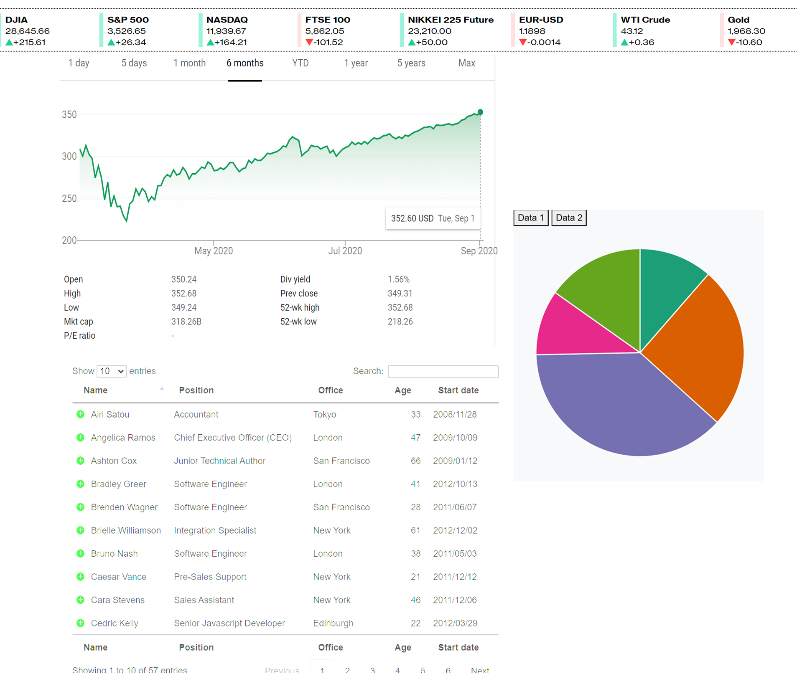

# Project2_Team01
Stock Information Information Visualization

## Team Members:
Brodie Armstrong | Tanner Leivois | Tyler Ward

## Project Description:

Deployed Project: https://stock-indices.herokuapp.com/

The aim of this application was to accurately and succinctly depict data that was submitted as a final data for the ETL(Extract, Transform, Load) project. 

Data was collected from a variety of sources and combined as a PostgreSQL database for future use. The database is hosted on heroku, and the application is deployed via the same methods.

The primary viz is depicting the performance of the 30 stocks that comprise the dow jones from 1-Jan-2017 through 7-Feb-2017, however the code was written to easliy allow for the furutre accomodation of constantly updated data. 

The tables at the bottom of the screens depict the data that is displayed in the chart above.

The donut chart or "sector breakdown" was created to display the individialu components and allow the user to visualize the sector representation within the DJI.

## Data Sources:

* https://www.kaggle.com/camnugent/sandp500/data
* https://www.alphavantage.co/documentation/
* Yahoo finance by using “pandas data reader” library

## Ideal Visualizations

* https://getbootstrap.com/docs/4.5/examples/dashboard/

## Additional Resources

* Observable notebook from which the time-series plot was based
    - https://observablehq.com/@mbostock/sea-ice-extent-1978-2017

* JQuery JS library from which the tables were based
    - https://datatables.net/

* Bootstrap example used for the execution of the Ticker
    - https://bbbootstrap.com/snippets/bootstrap-scrolling-breaking-news-ticker-53214404

* Where icons were sourced
    - https://material.io/
